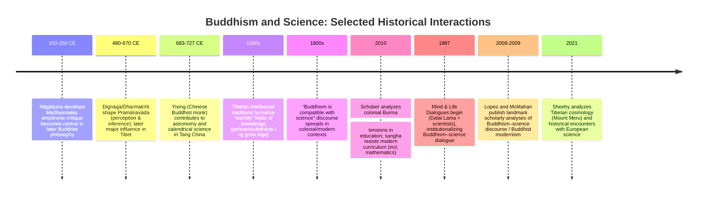

# Can Buddhist Philosophy Develop Science? Deep Research Report and Undergraduate Essay Draft

## Executive summary

This report supports (and then stress-tests) an undergraduate essay thesis that **traditional Buddhist philosophy is poorly suited to generate “modern science” as a self-sustaining, cumulative, mathematized, experimentally anchored institution**, because Buddhism’s **dominant motivational orientation (soteriology), metaphysical commitments, and epistemic ideals** prioritize liberation from suffering over open-ended explanation and prediction of nature. The argument is historical as well as philosophical: it claims not that Buddhists cannot *do* science, but that **Buddhism’s core worldview does not naturally supply the specific “mindset” and institutional incentives that historically produced modern science**. citeturn20view0turn8view0turn1search11

To make that thesis precise, the report adopts a “family resemblance” view of scientific method while still highlighting common methodological commitments: **systematic observation and experimentation; hypothesis/theory formation and testing; specialized mathematical formalisms; public, intersubjective criticism; reproducibility; and model-based explanation/prediction**. citeturn8view0turn9view1turn9view0 It then shows how an essay can argue that Buddhism’s central doctrinal clusters—**dependent origination, impermanence, no-self, karma/rebirth, two-truths/emptiness, and the primacy of contemplative transformation**—can be interpreted as discouraging (or deprioritizing) the pursuit of external, predictive natural knowledge for its own sake. citeturn20view0turn39view0turn33view0

Historically, the most visible “Buddhism and science” rapprochement is largely **modern**: since the nineteenth century, many Buddhists and Western admirers have claimed compatibility, sometimes going so far as to say Buddhism anticipated relativity or quantum physics. citeturn29view0 Scholars of modern Buddhism argue that these “scientific Buddhism” narratives are best understood as **Buddhist modernism**—a hybrid formation shaped by colonialism, global modernity, Western scientific prestige, and a selective “demythologizing” and “interiorizing” of Buddhism into a mind-science or psychology. citeturn28view0turn29view0 In other words, the compatibility discourse often looks like *Buddhism adapting to science*, not *science arising from Buddhism*. citeturn28view0turn29view0

Case studies used to support the thesis emphasize **institutional and curricular choices** rather than abstract doctrine alone. For example, in colonial Burma, tensions between Buddhist monastic education and British schooling included the **sangha’s refusal to teach a modern curriculum (notably mathematics, geography, and drawing)**—a direct, documentable conflict between Buddhist institutions and modern “colonial knowledge” forms. citeturn22view0 In Tibet, scholarly work on cosmology and astronomy shows both **active engagement with cosmological systems (e.g., Mount Meru frameworks)** and **complex encounters with European science earlier than often assumed**, yet still without the emergence of a modern, experimental, mathematized natural science comparable to early modern Europe. citeturn27view0turn29view0

At the same time, strong counterevidence and counterarguments must be addressed: Buddhist intellectual history includes sophisticated logic and epistemology (Pramāṇavāda), monastic education, and technical domains such as calendrics/astronomy (e.g., the monk Yixing in Tang China). citeturn20view0turn4search8turn27view0 Modern scientific studies also suggest meditation can affect attention and neural activity, supporting claims of “Buddhist empiricism” in a limited domain. citeturn30search1turn30search0turn30search2turn30search3 The report therefore provides a structured set of **counterarguments with rebuttals**, and also a “defense of the defense” (where rebuttals may be too strong).

Bottom line: a rigorous undergraduate essay can argue that Buddhism’s **soteriological priority and inward epistemic authority structure** make it *unlikely* to originate modern science without major reinterpretation and new institutions; but the essay must concede that Buddhism can (i) host technical knowledge, (ii) cultivate disciplined inquiry, and (iii) adapt to (and even partner with) modern science—especially in psychology/neuroscience contexts. citeturn20view0turn29view0turn36search2

## Framing the argument

This section clarifies what the essay is (and is not) claiming, to keep the thesis defensible against obvious objections (“but there are Buddhist scientists”).

**Assumptions (because the prompt leaves them open-ended).** This report treats “Buddhist philosophy” as a family of traditions (early Buddhist / Theravāda; Mahāyāna; Vajrayāna), noting internal diversity but focusing on shared doctrinal-motivational structures. It treats “science” as **modern, institutionally organized** inquiry characterized by experimental and mathematical practices and by public verification norms; it does **not** equate science with any and all careful observation or craft know-how. Citations follow an APA-like approach (author–date in the essay draft), while this report also provides inline scholarly citations. citeturn8view0turn6search0turn6search1

**Operational thesis (strong but defensible).** An analytically careful version of “Buddhism cannot develop science” is:

> In its classical forms, Buddhist philosophy **does not supply the characteristic motivational ends (world-mastery, open-ended natural explanation), epistemic norms (public reproducibility over transformative insight), and metaphysical background commitments** that historically enabled the rise of modern, mathematized, experimental natural science; therefore, Buddhist societies tended to import modern science rather than generate it endogenously.

This frames “cannot” as **historical–structural improbability**, not logical impossibility. That alignment matters because philosophy of science itself is pluralist about “one method,” but still identifies recurring features like systematic observation/experimentation and hypothesis/theory testing. citeturn8view0

**What “modern science” minimally requires (for the essay’s comparisons).** A useful undergrad-friendly bundle of “epistemic requirements” (not a rigid definition) is:

- **Public method**: claims should be checkable and criticizable by a community, with norms aiming at objectivity (as minimizing bias/perspective dependence). citeturn9view0  
- **Experiment and systematic observation**: not merely introspection but controlled interventions in/measurements of the physical or social world. citeturn7view11turn8view0  
- **Hypothesis/theory testing**: conjectures are evaluated against evidence; statistical and modeling practices are often central. citeturn8view0turn9view1  
- **Model-based explanation/prediction**: models (including mathematical/computational models) are built, tested, compared, and revised; prediction and explanation are key scientific functions even when science is not reducible to “prediction machines.” citeturn9view1turn8view0  

**Methodological caution for the essay.** Historians emphasize that “science” is historically situated; even the “Scientific Revolution” is debated as a coherent “event,” and social/institutional arrangements are central to explanations of why modern science arose where it did. citeturn6search0turn1search11 This helps the essay avoid naïve cultural essentialism: the argument should be “Buddhism’s worldview + its typical institutions often did not incentivize modern science,” not “Buddhists are irrational.”

## Historical context of Buddhism and science interactions

A strong essay needs a historical narrative that supports the “mindset/worldview” claim without ignoring counterexamples.

**From classical Buddhism to ‘scientific Buddhism’ discourse.** A major scholarly baseline is that explicit claims of Buddhism–science compatibility become especially prominent **from the nineteenth century onward**, continuing today. citeturn29view0 Lopez’s account (as presented by the University of Chicago Press) frames the discourse as a modern phenomenon in which Buddhists and “admirers” claim compatibility in ways ranging from meditation’s mental-health effects to claims that the Buddha anticipated modern physics. citeturn29view0 McMahan’s account of **Buddhist modernism** similarly describes reformulations that “borrow” scientific vocabulary to redescribe causality, interdependence, and meditation, and to recast Buddhism as a demythologized “interior science” or psychology. citeturn28view0

**Institutionalized dialogue in late twentieth century.** The Mind & Life dialogues exemplify the modern “partnership” phase: Mind & Life describes these dialogues as beginning in **1987** as conversations between the Dalai Lama and scientists at the intersection of contemplative and scientific understanding. citeturn36search2 Such initiatives show *compatibility in practice* but also (often) underscore the report’s thesis: modern science is already established; Buddhism is entering dialogue with it, not generating it from scratch.

**Premodern technical knowledge in Buddhist contexts (important nuance).** Buddhist cultures did sustain technical and scholarly pursuits (logic, medicine, calendrics). For example, a peer-reviewed article in *Religions* (MDPI) describes the Chinese monk **Yixing (683–727)** as uniquely significant both in Esoteric Buddhism and in astronomy/calendrical science in China. citeturn4search8 Tibet likewise includes astronomy/astrology and calendrical sciences embedded in cultural life. citeturn27view0turn4search1 These examples prevent the essay from collapsing into “Buddhism = anti-intellectual.” Instead, they help sharpen the claim: **technical sciences existed, but they typically served religious/civil functions and did not crystallize into modern experimental science**.

**Timeline of key interactions and inflection points.** The dates below are indicative anchors for an undergrad essay; they show the story moving from monastic scholasticism and cosmology to modern “compatibility” discourse and dialogue institutions. citeturn39view0turn27view0turn29view0turn36search2turn22view0



## Doctrinal and methodological tensions

This is the philosophical core: how the essay can argue that Buddhist doctrines and priorities produce a “worldview mismatch” with science.

### Key doctrinal clusters and why an essay might portray them as anti-science

**Soteriology as the organizing telos.** A central scholarly point is that Buddhist epistemologies—despite variation—share an aim of **spiritual liberation**. The Cambridge Handbook chapter summary explicitly states that early Buddhism, Pramāṇavāda, and Madhyamaka “share the aim of furthering the human quest for spiritual liberation.” citeturn20view0 This matters because the essay’s key move is to argue: if *liberation* is the final end, then knowledge of nature is often valued **instrumentally** (as it reduces suffering or supports practice), not as an open-ended project of explanation/prediction.

**Impermanence and “anti-substantialism.”** Classical Buddhist claims that conditioned phenomena are impermanent can be read as undermining a metaphysics of stable substances. For example, a Dhammapada passage commonly translated as “All conditioned things are impermanent… this is the path to purification” frames impermanence as a soteriological insight aimed at turning away from suffering, not as a hypothesis about physical processes to be mathematized and predicted. citeturn23search11 The essay can argue that modern science historically relied on stable measurement targets, lawlike regularities, and durable theoretical entities; a worldview that treats phenomena as momentary/empty may weaken intuitive commitment to such stability (even if it does not logically refute it). citeturn9view0turn9view1turn39view0

**No-self (anātman) and the subject/object configuration.** The Anattalakkhaṇa Sutta (SN 22.59) is a canonical locus for “not-self” teaching, challenging the idea of an enduring self. citeturn23search6 A pro-thesis essay can claim that if both “self” and “objects” lack intrinsic nature, then the everyday realist picture that underwrites naïve scientific objectivity is destabilized; science can still proceed, but Buddhism’s default philosophical sensibility encourages *de-reification* rather than *reification for modeling*. citeturn39view0turn9view0

**Dependent origination as a therapeutic causal web, not a predictive mechanism.** Dependent origination in early Buddhism is a structured causal account of suffering and its cessation; it is taught as a path-relevant analysis. citeturn5search3turn20view0 The essay can argue that this causal framework differs in aim and evidential culture from scientific causal modeling: it is more like a **diagnostic-therapeutic** model than a quantitative, externally testable mechanism. The mismatch is not “Buddhism denies causality”; it is “Buddhism’s paradigmatic causal explanation is soteriological.” citeturn20view0turn8view0

**Karma as moral causation, partly epistemically opaque.** Traditional karma involves moral/intentional causation across lifetimes; early Buddhist sources also treat the precise workings of karma as “imponderable”: AN 4.77 lists “the precise working out of the results of kamma” among topics whose scope can drive one to “madness and vexation.” citeturn1search9 This creates an essay-friendly contrast with science: modern science tends to treat causal mechanisms as (in principle) publicly investigable and modelable, whereas karma includes irreducibly moral and often non-observable causal claims, and even warns against over-speculation. citeturn8view0turn1search9

**Emptiness and two truths as potential anti-realism.** The SEP entry on Nāgārjuna emphasizes that Madhyamaka centers on “emptiness” and critiques svabhāva (intrinsic nature), and explains that realizing the non-existence of svabhāva has **soteriological consequences**—liberation from suffering. citeturn39view0 If “emptiness” functions as a critique of “ontological foundations,” an essay may argue that it leans away from scientific realism (the idea that science discovers mind-independent structures) toward deflationary or anti-foundational sensibilities. citeturn39view0turn9view0 Whether that truly conflicts with science is debated; but it supports the “worldview mismatch” narrative.

**Anti-speculative orientation in early discourses (a ‘don’t get distracted’ norm).** Early Buddhist texts contain warnings about speculative metaphysical questions as spiritually unprofitable (commonly exemplified by the “poisoned arrow” parable in MN 63). citeturn0search3 Even if science is not “metaphysics,” the essay can argue that a culture trained to treat cosmological speculation as distraction may be less likely to develop the research temperament that invests in open-ended natural philosophy.

### Comparative table: doctrines vs. scientific epistemic requirements

The table below is designed to be dropped into an undergraduate essay (or adapted). It frames “conflict” as **alleged tension** and includes compatibility notes to keep the argument honest.

| Buddhist doctrine/practice | Core orientation (essay-friendly summary) | Alleged mismatch with modern scientific epistemic requirements | Compatibility notes a critic should concede |
|---|---|---|---|
| Soteriology (“liberation” as final end) | Knowledge is valuable insofar as it ends suffering and supports awakening; epistemology serves liberation citeturn20view0 | Science valorizes open-ended inquiry, prediction, and control; Buddhism may treat such projects as spiritually secondary or distracting citeturn8view0 | Buddhism can still endorse conventional knowledge as skillful means; modern Buddhists explicitly affirm learning from science citeturn32search1turn28view0 |
| Impermanence (anicca) | “All conditioned things are impermanent” is a contemplative insight aimed at purification citeturn23search11 | Undermines intuitive commitment to stable substances and fixed essences, potentially weakening realist “object” metaphysics used in modeling citeturn9view1turn39view0 | Science itself models change; impermanence can be re-read as congruent with process metaphysics and dynamical systems (not uniquely Buddhist) citeturn9view1 |
| No-self (anātman) | The person is not an enduring self; aggregates are not-self citeturn23search6 | Challenges subject/object dualism; may complicate “view from nowhere” ideals of objectivity citeturn9view0 | Contemporary cognitive science also questions a unified self; Buddhism can contribute phenomenology without blocking external measurement citeturn30search3turn36search2 |
| Dependent origination | Path-relevant causal diagnosis of suffering and its cessation citeturn5search3turn20view0 | Causality is framed ethically/therapeutically; not naturally mathematized; not designed for quantitative prediction citeturn8view0turn9view1 | Can be reinterpreted as a general relational ontology; modernists borrow scientific vocabulary for “interdependence” citeturn28view0 |
| Karma & rebirth | Moral causation; precise workings partly “imponderable” citeturn1search9 | Incorporates non-observable causal claims; discourages complete causal transparency; conflicts with methodological naturalism in many sciences citeturn8view0turn1search9 | Ethical psychology can be studied scientifically without endorsing metaphysical rebirth claims; Buddhists may bracket metaphysics in dialogue settings citeturn36search2turn29view0 |
| Madhyamaka emptiness / anti-foundational critique | Emptiness critiques intrinsic nature; realization is soteriologically transformative citeturn39view0turn20view0 | Can be cast as anti-realism about “basic furniture of the world,” destabilizing strong scientific realism or “laws as ontological bedrock” citeturn39view0turn9view0 | Science does not require metaphysical foundationalism; many philosophies of science are anti-realist or instrumentalist yet support prediction/testing citeturn8view0turn9view1 |
| Contemplative “direct insight” | Epistemic authority given to meditative realization; can be construed as a kind of “yogic perception” citeturn33view0turn20view0 | Introspective insights are hard to publicly reproduce/measure; may privilege first-person certainty over intersubjective testing citeturn9view0turn8view0 | Modern contemplative science explicitly tries to integrate first-person reports with third-person measures; mixed results, but not impossible citeturn36search2turn30search3 |

## Epistemology: pramāṇa and insight vs. scientific epistemology

A rigorous essay must move beyond “Buddhism is empirical” slogans and show how Buddhist *epistemic structures* differ from scientific ones.

**Buddhist epistemology in three lenses (early / Pramāṇavāda / Madhyamaka).** The Cambridge Handbook chapter summary provides a compact scholarly map: early Buddhist epistemology is often seen as a kind of empiricism emphasizing personal sensory and “supersensory” knowledge; Pramāṇavāda recognizes perception and inference as means keyed to particulars and universals; Madhyamaka critically examines the interdependence of objects of knowledge and means of knowing, focusing on “two truths.” citeturn20view0 Crucially, the chapter summary adds that these diverse epistemologies share a **liberation-oriented aim**. citeturn20view0

**Scientific epistemology: community objectivity and method pluralism.** The SEP entry on scientific method stresses that accounts of scientific method commonly include systematic observation/experimentation and hypothesis/theory formation/testing, while also emphasizing that science varies across fields and that method is intertwined with institutional practices and values (objectivity, reproducibility). citeturn8view0 The SEP entry on scientific objectivity defines objectivity as aiming for claims/methods/results not influenced by perspectives, value judgments, bias, or interests, and connects objectivity to reproducibility and measurement/quantification debates. citeturn9view0

**The essay’s central epistemic contrast.** An essay defending the thesis can argue:

- Buddhist tradition often includes **transformative epistemic achievement**: knowledge is “valid” insofar as it produces liberation (or reduces suffering). citeturn20view0turn33view0turn39view0  
- Modern science prioritizes **publicly checkable** evidence and community criticism; even where first-person experience matters, claims aim to be testable, modelable, and reproducible within a research community. citeturn9view0turn8view0turn9view1  

**Yogic perception as a revealing case.** John Dunne’s peer-reviewed analysis of Dharmakīrti’s “yogic perception” (as summarized in Springer’s abstract) states that Dharmakīrti construes paradigmatic objects of yogic perception as the Four Noble Truths; the epistemic problem is how nonconceptual cognition can apprehend conceptual objects like impermanence; and Dunne notes Dharmakīrti “downplays” yogic perception as encounter with real external things, emphasizing instead that what differentiates realization from hallucination is salvific effect. citeturn33view0 This is tailor-made for the essay’s thesis: it suggests that even sophisticated Buddhist epistemology can treat “valid cognition” as validated by **transformative efficacy** rather than correspondence with publicly testable external objects—an orientation different from most scientific epistemology (especially in the physical sciences). citeturn33view0turn9view1turn9view0

## Sociocultural and institutional factors with case studies

A purely doctrinal argument (“Buddhist metaphysics blocks science”) is historically fragile. Strong essays add sociocultural mechanisms: education, patronage, monastic incentives, and the social location of knowledge.

### Why institutions matter for “developing science”

Historians of science stress that modern science’s emergence cannot be explained only by “good ideas”; institutional, legal, and cultural arrangements that support inquiry (including who funds it, how knowledge circulates, and how dissent is handled) are essential explanatory variables. citeturn1search11turn6search0turn8view0 A pro-thesis essay can claim: even when Buddhist philosophy contains rational debate and technical learning, **its dominant institutions** frequently sorted knowledge into “inner” liberation knowledge vs. “outer” worldly knowledge—often treating the latter as subordinate. citeturn20view1turn20view0

### Case study: colonial Burma education conflict

Juliane Schober’s Oxford Scholarship chapter abstract states that in colonial Burma, tensions between Buddhist and British educational institutions shaped politics and identity, and that **“the sangha refused to teach a modern curriculum, particularly mathematics, geography, and drawing.”** citeturn22view0

This provides a concrete essay-ready mechanism: if key educational institutions resist mathematics and related representational disciplines—central to modern science’s mathematization and measurement culture—then even if Buddhist doctrine is not inherently anti-science, Buddhist institutional priorities can **delay the diffusion of scientific competencies**. citeturn22view0turn8view0turn9view0

### Case study: Tibet, cosmology, and encounters with European science

Michael R. Sheehy’s article (Springer abstract) argues that historical sources on astronomy and geography in Tibet complicate simplistic stories: it challenges claims that Tibetans did not encounter European science until the twentieth century and were unaware of scientific cosmological ideas; it explicitly frames inquiry around Mount Meru cosmology in Tibet and the contemporary science–religion binary. citeturn27view0 This helps a thesis-driven essay in two ways:

First, it provides historical substance: Tibetan intellectual life included cosmological systems and scientific encounters. citeturn27view0 Second, it allows a nuanced claim: **even with encounters and technical astro-sciences, Tibetan Buddhism did not produce an early-modern-style scientific revolution**, arguably because knowledge remained embedded in ritual, cosmology, and soteriological frameworks rather than developing into a self-authorizing experimental/mathematical research program. citeturn27view0turn1search11turn6search1

### Case study: “secular knowledge” ambivalence in Tibetan learning

Dominique Townsend’s abstract (HIMALAYA) notes that Tibetan leaders were steeped in an Indic knowledge classification (pañcavidyāsthāna / rig gnas lnga), and highlights **ambivalence** about the relationship between worldly and religious learning, even while worldly knowledge conveyed prestige and political/cultural connections. citeturn20view1 This supports the thesis’s sociocultural layer: Buddhism could value “worldly knowledge,” yet it often had to be justified within (or subordinated to) religious and political projects rather than standing as an autonomous truth-seeking enterprise. citeturn20view1turn20view0

### Counterexample pressure: Buddhist technical expertise exists

A persuasive essay must concede counterevidence: Buddhist monks sometimes contributed to technical sciences. Yixing is a strong example as a monk involved in astronomy and calendrical science. citeturn4search8 The thesis-friendly response is not denial but **reclassification**: such achievements show Buddhism can host scholarship, but they may still be consistent with the broader historical claim that modern science—especially experimental physics and mathematical natural law traditions—did not emerge as a self-sustaining institution from Buddhist soteriology alone. citeturn1search11turn6search1turn8view0

## Proponent counterarguments with rebuttals and defenses

This section equips the essay to anticipate objections and respond rigorously. It also models intellectual honesty: rebuttals should include concessions.

### Table of counterarguments and detailed rebuttals

| Proponent counterargument | Typical support offered | Rebuttal supporting the thesis | “Defense of the rebuttal” (where rebuttal may be too strong) |
|---|---|---|---|
| Buddhism is compatible with science; compatibility claims have been made since the 19th century | Modern discourse linking Buddhism and science; claims range from meditation benefits to “Buddha anticipated physics” citeturn29view0 | Compatibility discourse can be framed as **modern construction** shaped by colonial modernity; it often functions to grant Buddhism scientific prestige rather than to explain science’s origins in Buddhist contexts citeturn28view0turn29view0 | Compatibility claims can be partially true in limited domains (psychology, ethics, phenomenology). The modern origin of a discourse doesn’t alone refute its content. citeturn30search3turn36search2 |
| Buddhism is “empirical” (early Buddhism relies on personal experience) | Scholarly summaries describe early Buddhist epistemology as empiricism grounded in personal sensory/supersensory knowledge citeturn20view0 | “Personal empiricism” is not identical to **public experimental method**; Buddhist empiricism often validates claims by **transformative outcomes** (liberation) rather than by reproducible measurement and prediction citeturn33view0turn9view0turn8view0 | Science also uses trained perception and sometimes relies on expert judgment; the line between “personal” and “public” is not absolute. Still, modern science institutionalizes public checking more aggressively. citeturn9view0turn8view0 |
| Pramāṇavāda (perception + inference) shows rigorous rational epistemology akin to science | Pramāṇavāda recognizes perception and inference; sophisticated logic traditions citeturn20view0turn33view0 | Even when formally rigorous, Buddhist epistemology is **teleologically constrained** by liberation; “valid cognition” can be oriented to salvific efficacy rather than external correspondence/prediction citeturn20view0turn33view0 | Formal logic/inference are prerequisites for science; the presence of logic weakens any claim that Buddhism lacks rationality. The stronger thesis must be about aims/institutions, not “irrationality.” citeturn8view0turn6search0 |
| Meditation cultivates cognitive skills relevant to science (attention, emotional regulation) | Empirical studies: mindfulness training modifies attention subsystems; long-term meditators show distinctive EEG patterns; meta-analyses show stress reductions citeturn30search1turn30search0turn30search2turn30search3 | Even if meditation improves attention, that does not generate **the social machinery of science** (peer review, laboratories, mathematization, modeling communities). Cognitive skill ≠ scientific institution citeturn8view0turn9view1turn1search11 | Still, cognitive training can support scientific practice indirectly, especially in attention-heavy fields. This supports a weaker compatibility thesis (Buddhism can help scientists), not the stronger origination claim (Buddhism generates science). citeturn30search3turn36search2turn29view0 |
| Buddhist institutions (monasteries) were education hubs; therefore Buddhism supports scholarship | Examples of monastic learning and “worldly knowledge” traditions; Tibetan pañcavidyāsthāna/rig gnas lnga citeturn20view1 | Monastic education can be **textual, doctrinal, and soteriological** rather than experimentally oriented; “worldly knowledge” may be treated as subordinate or ambivalent, not science-as-autonomous-project citeturn20view1turn20view0 | Some monasteries did support technical knowledge (medicine, calendrics); this undermines absolute claims (“Buddhism hates worldly knowledge”). The thesis must remain comparative: why not *modern* science? citeturn4search8turn27view0 |
| The Dalai Lama and modern Buddhists explicitly embrace science and revision of beliefs | Dalai Lama: “If science proves some belief of Buddhism wrong, then Buddhism will have to change.” citeturn32search1 | This is evidence of **modern adaptive stance**, not historical evidence that Buddhism generates modern science; it may reflect modern pressure to align with scientific authority citeturn28view0turn29view0 | The Dalai Lama’s stance shows a live internal resource: doctrinal flexibility that can accommodate science, weakening any claim of necessary conflict. It still doesn’t explain endogenous origin. citeturn32search1turn36search2 |
| Buddhism and science share anti-theistic naturalism (no creator God) | Some argue Buddhism avoids a transcendent creator, like science citeturn29view0 | Absence of a creator does not equal commitment to scientific naturalism; Buddhism includes karma, rebirth, ritual cosmology; also warns against certain speculative questions (imponderables) citeturn1search9turn27view0 | Many sciences do not require metaphysical atheism; and some Buddhist modernists bracket metaphysical claims in practice. The key tension is not “God,” but epistemic norms and aims. citeturn8view0turn29view0turn28view0 |

## Structured essay outline and full essay draft

### Structured outline

**Title (example):** *Why Traditional Buddhist Philosophy Did Not Generate Modern Science: A Worldview and Institutional Argument*

**Introduction**
- Hook: modern popularity of “Buddhism is scientific” claims
- Define “modern science” (method + institutions)
- Thesis: Buddhism’s soteriology and epistemic ideals deprioritize modern science; modern compatibility is largely adaptive modernism citeturn29view0turn28view0turn20view0

**Conceptual framework**
- Science: observation/experiment, hypothesis/testing, objectivity norms, modeling/prediction citeturn8view0turn9view0turn9view1
- Buddhism: liberation-oriented epistemology; doctrinal diversity but shared telos citeturn20view0

**Doctrinal analysis**
- Soteriology as telos (knowledge as therapeutic)
- Impermanence and no-self as de-reifying metaphysics citeturn23search11turn23search6
- Karma as moral causation + imponderables citeturn1search9
- Madhyamaka emptiness as anti-foundational critique with soteriological payoff citeturn39view0
- Epistemology: pramāṇa; yogic perception shows salvific validation citeturn20view0turn33view0

**Historical and institutional analysis**
- Modern “compatibility discourse” since 19th century; Buddhist modernism thesis citeturn29view0turn28view0
- Case study: colonial Burma education conflict (math/geography/drawing refusal) citeturn22view0
- Case study: Tibet—cosmology and encounters with European science; why no scientific revolution citeturn27view0turn1search11
- Nuance: monastic scholarship and technical sciences (Yixing) citeturn4search8

**Counterarguments and responses**
- Buddhist empiricism and meditation science
- Monasteries as education hubs
- Dalai Lama’s pro-science stance
- Rebuttal: compatibility ≠ origination; cognitive benefits ≠ institutions citeturn30search2turn32search1turn8view0

**Conclusion**
- Restate thesis in qualified form
- Implications: Buddhism can contribute to contemplative science today, but modern science’s rise requires different incentives/institutions citeturn36search2turn28view0turn1search11

### Full essay draft (undergraduate level, up to ~10 pages double-spaced)

**Why Traditional Buddhist Philosophy Did Not Generate Modern Science: A Worldview and Institutional Argument**

**Introduction**

In contemporary popular culture and even some academic-adjacent discourse, Buddhism is often portrayed as uniquely “scientific”—a tradition of calm rationality and introspective empiricism that naturally harmonizes with modern neuroscience and physics. Donald S. Lopez Jr. notes that, beginning in the nineteenth century and continuing today, Buddhists and admirers of Buddhism have repeatedly proclaimed “compatibility,” ranging from modest claims about meditation’s therapeutic value to sweeping assertions that the Buddha anticipated relativity or the Big Bang. citeturn29view0 These claims generate a provocative question: if Buddhism is so compatible with science, why did Buddhist cultures not historically produce modern science as a self-sustaining institution?

This essay argues that **traditional Buddhist philosophy did not generate modern science**—not because Buddhists are irrational or hostile to knowledge, but because Buddhism’s dominant “mindset” is structured around a different ultimate project. Across diverse forms of Buddhism, epistemology and metaphysics are oriented toward **soteriology**: liberation from suffering and cyclic existence. citeturn20view0 Modern science, by contrast, is oriented toward a publicly verifiable body of knowledge produced through systematic observation and experimentation, hypothesis and theory testing, and extensive model-building—often mathematical and predictive—within a community governed by norms of objectivity and reproducibility. citeturn8view0turn9view0turn9view1

**Thesis:** While Buddhism can adapt to and cooperate with modern science (and in some contexts contribute resources for studying the mind), **its classical worldview and institutional priorities do not naturally generate the motivational ends, epistemic norms, and social mechanisms that historically produced modern, experimental, mathematized science**. When “Buddhism and science” appear aligned today, this alignment is often best understood as **Buddhist modernism**—a modern hybrid shaped by Western scientific prestige and modernity—rather than as evidence that Buddhism itself historically develops modern science. citeturn28view0turn29view0

**What counts as “modern science”?**

The term “science” is not reducible to a single universal method, and philosophers of science caution against simplistic, one-size-fits-all accounts. Nevertheless, standard characterizations of scientific method highlight recurring activities: systematic observation and experimentation, inductive and deductive reasoning, and the formation and testing of hypotheses and theories. citeturn8view0 Science also relies heavily on models—conceptual, mathematical, and computational—that are built, tested, compared, and revised, and that can support explanation and prediction. citeturn9view1 Equally central are norms of objectivity: scientific claims and methods are supposed to be (as far as possible) insulated from personal bias, parochial perspective, or narrow interests, and supported by practices like measurement, quantification, and reproducibility. citeturn9view0

This essay will therefore treat modern science as **a historically developed, institutionally organized practice** combining (i) empirical investigation of nature through observation and experiment, (ii) formal modeling and quantification, and (iii) communal methods of criticism and verification. citeturn8view0turn9view0turn9view1

**Buddhist philosophy as liberation-oriented inquiry**

The conceptual heart of Buddhism is not a drive to explain nature in ever more comprehensive causal models. Rather, Buddhist philosophy is structured around a therapeutic goal: diagnosing and ending suffering. The Cambridge Handbook of Religious Epistemology summarizes a crucial point: despite significant internal differences, early Buddhism, Pramāṇavāda, and Madhyamaka share “the aim of furthering the human quest for spiritual liberation.” citeturn20view0

This soteriological telos has two consequences for scientific development. First, it shapes what questions are worth asking: knowledge is valuable insofar as it transforms the practitioner and reduces suffering. Second, it shapes how knowledge is validated: insight is often evaluated by its role in liberation rather than solely by its public predictive success. citeturn20view0turn33view0

**Doctrines that can be read as anti-scientific (or at least non-scientific)**

A pro-thesis argument does not need to claim Buddhist doctrines are logically inconsistent with science. Instead it can argue that they create a worldview that **deprioritizes** scientific inquiry.

First, the doctrines of impermanence and not-self are framed as soteriological insights. A Dhammapada passage commonly rendered as “All conditioned things are impermanent… this is the path to purification” explicitly connects the recognition of impermanence to turning away from suffering and achieving purification. citeturn23search11 This is not offered as a research hypothesis to be measured or mathematized, but as a contemplative insight that loosens attachment. The Anattalakkhaṇa Sutta similarly deploys the analysis of aggregates to undermine identification with an enduring self. citeturn23search6

From a scientific-development angle, one can argue that such teachings cultivate a sensibility of **de-reification**: language and concepts are tools, and the world is not naturally carved into stable “things.” This sensibility may be philosophically astute, but it does not automatically motivate building stable models of external mechanisms. Modern science, even when it models change, often depends on stable measurement practices, durable theoretical structures, and pragmatic reifications (atoms, fields, genes, forces) that are collectively refined over time. citeturn9view1turn8view0

Second, dependent origination provides a causal framework, but its paradigmatic function is diagnostic and path-relevant: it explains the arising of suffering and the conditions for its cessation. citeturn5search3turn20view0 A thesis-driven essay can argue that this is closer to a therapeutic model than to a general scientific program: it is designed to guide practice, not to produce quantitative predictions about external nature.

Third, karma introduces a form of moral causation that does not map neatly onto scientific investigation. Moreover, early Buddhism warns that certain domains are “inconceivable” or “not to be conjectured about,” including “the precise working out of the results of kamma.” citeturn1search9 Even if one interprets this as a pragmatic warning against obsession rather than an anti-intellectual ban, it still signals that some causal questions are not treated as open to unlimited rational inquiry. Modern science, by contrast, typically treats causal explanation as indefinitely extensible in principle, constrained by evidence and method rather than by spiritual danger. citeturn8view0turn9view0

Fourth, Madhyamaka philosophy can be read as anti-foundational. The SEP entry on Nāgārjuna emphasizes that emptiness is directed against svabhāva (intrinsic nature) and that Nāgārjuna rejects the existence of an ontological foundation; it also stresses that realizing the absence of svabhāva is not merely theoretical but has major **soteriological consequences**, contributing to liberation from suffering. citeturn39view0 If the world has no “rock-bottom furniture,” one might argue that the metaphysical imagination conducive to discovering fundamental laws of nature is weakened. Even if this is contestable—science can proceed without metaphysical foundationalism—it illustrates that Buddhism’s most sophisticated metaphysics is again oriented toward liberation and deconstructing reified categories, not toward constructing a cumulative natural philosophy. citeturn39view0turn9view1

**Epistemology: pramāṇa, yogic perception, and the problem of public verification**

Buddhist epistemology is not simply “faith.” Yet its structure differs from scientific epistemology in ways that matter for developing science. The Cambridge Handbook summary notes that early Buddhist epistemology is often regarded as empiricism, while Pramāṇavāda focuses on perception and inference, and Madhyamaka examines the interdependence of knowing and objects known. citeturn20view0 This resembles scientific sensibilities at a high level. The crucial divergence is the shared goal: liberation. citeturn20view0

John Dunne’s analysis of Dharmakīrti’s “yogic perception” sharpens the contrast. Dunne explains that Dharmakīrti treats the Four Noble Truths as paradigmatic objects of yogic perception; the epistemological puzzle is how nonconceptual cognition can apprehend conceptual objects like impermanence; and Dharmakīrti ultimately downplays yogic perception as an encounter with real external things, emphasizing instead that what matters is the salvific effect induced by meditative experience—even when the experience may be phenomenally akin to hallucination. citeturn33view0

From a scientific standpoint, this is revealing: the criterion of validity is not (only) public correspondence or predictive success, but transformative outcome. Science can accept that some knowledge is practical; however, modern science’s authority is tied to public methods and community verification—exactly what introspective yogic experience does not naturally provide. citeturn9view0turn8view0

**Historical reality: modern science’s rise and Buddhism’s modern adaptations**

The thesis gains force when paired with a historical claim: modern science arose in a particular institutional and cultural setting (early modern Europe) and did not arise in Buddhist societies, even when those societies were intellectually sophisticated. Historians emphasize that modern science’s emergence depends on social, legal, and institutional arrangements, not only on abstract rationality. citeturn1search11turn6search0

Meanwhile, the most famous “Buddhism is scientific” narratives are modern. Lopez’s account describes how nineteenth-century and later figures constructed a persistent linkage between Buddhism and science, including reinterpretations of cosmology (e.g., Mount Meru) when it conflicted with modern geography. citeturn29view0 McMahan’s account of Buddhist modernism explicitly explains that modern Buddhism is a hybrid cross-fertilized with Western ideas, including “liberal borrowing from scientific vocabulary” and reconceiving Buddhism as a psychology or “interior science.” citeturn28view0 These scholarly frames support a key inference: **the Buddhism–science synthesis is largely reactive and modern**, not evidence that Buddhism historically birthed modern science.

**Case studies: when Buddhist institutions resisted “modern knowledge”**

A single well-chosen case study can do more than pages of abstract metaphysics. Schober’s analysis of education in colonial Burma notes that the sangha refused to teach a modern curriculum, “particularly mathematics, geography, and drawing.” citeturn22view0 While colonial power dynamics complicate interpretation (resistance might be political rather than philosophical), the case still shows a concrete institutional mechanism: Buddhist monastic systems could act as **gatekeepers**, prioritizing religious literacy over modern scientific-mathematical competencies that later became essential to science.

Tibet provides another instructive case. Sheehy’s study on Mount Meru cosmology argues that Tibetans encountered European science earlier than sometimes claimed and that Tibetan sources engaged astronomy and geography in ways relevant to today’s “science vs. religion” binary. citeturn27view0 Yet Tibet did not develop a modern scientific revolution. A thesis-driven interpretation is that Tibetan scholarly life remained embedded in cosmological, ritual, and soteriological frameworks, and lacked the institutional ecology—laboratories, mathematical physics traditions, and autonomous knowledge communities—characteristic of early modern European science. citeturn27view0turn6search1turn1search11

**A crucial concession: Buddhism can host technical science**

The thesis must concede that Buddhist cultures did produce technical and scholarly achievements. A strong counterexample is the monk Yixing, who was both significant in Esoteric Buddhism and a figure in Chinese astronomy and calendrical science. citeturn4search8 Such cases refute any simplistic claim that Buddhism is uniformly anti-intellectual or practically disengaged from nature.

But the concession can be integrated without abandoning the thesis. The argument is not “Buddhists cannot count stars,” but “modern science requires a distinctive institutional, epistemic, and motivational configuration.” Calendrical astronomy can flourish for ritual, agricultural, and bureaucratic reasons without producing a self-sustaining experimental physics tradition aimed at uncovering universal laws through mathematized modeling and public replication. citeturn9view1turn8view0turn1search11

**Counterarguments: Buddhist empiricism and meditation science**

Proponents of compatibility often cite meditation research. For example, PNAS reports that long-term Buddhist practitioners can self-induce sustained high-amplitude gamma synchrony during meditation, differing from controls. citeturn30search0 Jha, Krompinger, and Baime report that mindfulness training modifies subsystems of attention. citeturn30search1 Meta-analytic work in *JAMA Internal Medicine* examines meditation programs and finds measurable effects on stress-related outcomes. citeturn30search2 Creswell’s *Annual Review of Psychology* article surveys mindfulness interventions and their psychological and neurobiological mechanisms. citeturn30search3 These findings plausibly support a claim that Buddhist-derived practices can be studied scientifically and may cultivate capacities relevant to scientific work.

The thesis response is twofold. First, such research typically shows **science studying Buddhism**, not Buddhism generating science. Second, even if meditation strengthens attention, it does not generate the wider scientific institution: mathematical training, experimental infrastructure, and community norms of public verification. citeturn8view0turn9view0turn1search11 Buddhist practices may be compatible with science and even beneficial to scientists, but that is compatible with the claim that Buddhist philosophy did not historically produce modern science.

**Modern Buddhist embrace of science (and why it doesn’t refute the thesis)**

Modern Buddhist leaders sometimes endorse revising beliefs in light of science. On the Dalai Lama’s official website, he states: “If science proves some belief of Buddhism wrong, then Buddhism will have to change,” and he describes science and Buddhism as sharing a search for truth and understanding reality. citeturn32search1 This is an important internal resource for compatibility.

Yet, as Lopez and McMahan emphasize, the prominence of such stances fits a broader modern pattern: Buddhism is being reformulated in conversation with modern science and modernity. citeturn29view0turn28view0 The Dalai Lama’s openness therefore supports a *compatibility-in-dialogue* thesis more than it supports a *science-originates-from-Buddhism* thesis.

**Conclusion**

Buddhist philosophy contains disciplined inquiry, sophisticated epistemology, and practices that can be scientifically investigated. It can also adapt to science in the modern world, and some Buddhist leaders explicitly welcome scientific correction of certain beliefs. citeturn20view0turn32search1turn29view0 Nevertheless, when we ask why Buddhist cultures did not historically produce modern science, the strongest answer is structural: Buddhism’s dominant worldview and institutions are shaped by soteriology and contemplative transformation, and therefore tend to treat external natural inquiry as subordinate, instrumental, or spiritually ambiguous rather than as an autonomous, cumulative, mathematized project. citeturn20view0turn33view0turn28view0

The best defensible formulation of the original claim is therefore not that Buddhists cannot do science, but that **traditional Buddhist philosophy does not naturally generate the particular mindset and institutional ecology that historically produced modern science**. Where science thrives in Buddhist societies today, it typically does so through imported institutions and modern hybrid reinterpretations—precisely the pattern emphasized by scholars of Buddhist modernism and the modern “scientific Buddhism” discourse. citeturn28view0turn29view0turn1search11

**References (APA-style, no live links)**  
Creswell, J. D. (2017). *Mindfulness interventions*. *Annual Review of Psychology, 68*, 18.1–18.26. doi:10.1146/annurev-psych-042716-051139 citeturn30search3  
Dunne, J. D. (2006/2007). Realizing the unreal: Dharmakīrti’s theory of yogic perception. *Journal of Indian Philosophy, 34*, 497–519. doi:10.1007/s10781-006-9008-y citeturn33view0  
Frigg, R., & Hartmann, S. (2025). Models in science. *Stanford Encyclopedia of Philosophy*. citeturn9view1  
Harrison, V. S., & Zhao, J. (2023). Buddhist religious epistemology. In J. Fuqua, J. Greco, & T. McNabb (Eds.), *The Cambridge Handbook of Religious Epistemology*. Cambridge University Press. doi:10.1017/9781009047180.015 citeturn20view0  
Hepburn, B., & Andersen, H. (2015/2021). Scientific method. *Stanford Encyclopedia of Philosophy*. citeturn8view0  
Huff, T. E. (3rd ed.). *The Rise of Early Modern Science*. Cambridge University Press. citeturn1search11  
Jha, A. P., Krompinger, J., & Baime, M. J. (2007). Mindfulness training modifies subsystems of attention. *Cognitive, Affective, & Behavioral Neuroscience, 7*(2), 109–119. doi:10.3758/CABN.7.2.109 citeturn30search1  
Lopez, D. S., Jr. (2008). *Buddhism and Science: A Guide for the Perplexed*. University of Chicago Press. citeturn29view0  
Lutz, A., Greischar, L. L., Rawlings, N. B., Ricard, M., & Davidson, R. J. (2004). Long-term meditators self-induce high-amplitude gamma synchrony during mental practice. *PNAS*. doi:10.1073/pnas.0407401101 citeturn30search0  
McMahan, D. L. (2009). *The Making of Buddhist Modernism*. Oxford University Press. citeturn28view0  
Schober, J. (2010). Educating the other: Buddhism and colonial knowledge. In *Modern Buddhist Conjunctures in Myanmar*. Oxford Scholarship Online. doi:10.21313/hawaii/9780824833824.003.0004 citeturn22view0  
Sheehy, M. R. (2021). The offering of Mount Meru: Contexts of Buddhist cosmology in the history of science in Tibet. *Journal of Dharma Studies, 3*, 319–348. doi:10.1007/s42240-020-00089-5 citeturn27view0  
Sprenger, J., & Reiss, J. (2014/2020). Scientific objectivity. *Stanford Encyclopedia of Philosophy*. citeturn9view0  
Townsend, D. (2016). Buddhism’s worldly other: “Secular” subjects of Tibetan learning. *HIMALAYA, 36*(1). citeturn20view1  
Yixing: See analysis in *Religions* (2022) on monk Yixing’s astronomical innovations. citeturn4search8  

## Suggested further reading and web links

### Further reading (recommended scholarly sources)

The following are particularly useful for writing a rigorous undergraduate paper that is both critical and fair:

- Lopez, D. S., Jr. *Buddhism and Science: A Guide for the Perplexed* citeturn29view0  
- McMahan, D. L. *The Making of Buddhist Modernism* citeturn28view0  
- Thompson, E. *Why I Am Not a Buddhist* (critique of “Buddhist exceptionalism”) citeturn35search2  
- Dunne, J. D. “Realizing the unreal: Dharmakīrti’s theory of yogic perception” citeturn33view0  
- Sheehy, M. R. “The offering of Mount Meru…” (Tibet, cosmology, history of science) citeturn27view0  
- Huff, T. E. *The Rise of Early Modern Science* (institutions and why modern science arose where it did) citeturn1search11  
- Shapin, S. *The Scientific Revolution* (classic historiographical framing) citeturn6search0  
- Harrison & Zhao, “Buddhist Religious Epistemology” (Cambridge Handbook chapter) citeturn20view0  

### Web links (primary texts and scholarly resources)

Copy/paste links (presented in code blocks to avoid clutter and preserve exact URLs):

```text
Primary Buddhist / classical sources (translations)
- AN 4.77 “Inconceivable/Imponderable (includes karma as imponderable)” (Thanissaro): https://buddhadust.net/dhamma-vinaya/ati/an/04_fours/an04.077.than.ati.htm
- SN 22.59 “Anatta-lakkhana Sutta: Not-self characteristic” (Ñanamoli, Access to Insight): https://www.accesstoinsight.org/tipitaka/sn/sn22/sn22.059.nymo.html
- Dhammapada 277 (impermanence; The Buddha’s Words): https://thebuddhaswords.net/dhp/dhp273-289.html
- Dependent origination (Bhikkhu Bodhi translation excerpt, obo.genaud.net): https://obo.genaud.net/dhamma-vinaya/wp/sn/02_nv/sn02.12.001.bodh.wp.htm
```

```text
Key scholarly / reference resources used in this report
- Lopez (University of Chicago Press page): https://press.uchicago.edu/ucp/books/book/chicago/B/bo6040538.html
- McMahan (Oxford Academic page): https://academic.oup.com/book/36354
- Dunne (Springer abstract page): https://link.springer.com/article/10.1007/s10781-006-9008-y
- Sheehy (Springer abstract page): https://link.springer.com/article/10.1007/s42240-020-00089-5
- SEP “Scientific Method”: https://plato.stanford.edu/entries/scientific-method/
- SEP “Scientific Objectivity”: https://plato.stanford.edu/entries/scientific-objectivity/
- SEP “Models in Science”: https://plato.stanford.edu/entries/models-science/
- SEP “Nāgārjuna”: https://plato.stanford.edu/entries/nagarjuna/
- Dalai Lama official site (“Our faith in science”): https://www.dalailama.com/news/2005/our-faith-in-science
- Mind & Life Institute (Dialogues began in 1987): https://www.mindandlife.org/events/mind-and-life-dialogues/
- Yixing astronomy article (peer-reviewed, MDPI Religions): https://www.mdpi.com/2077-1444/13/6/543
```